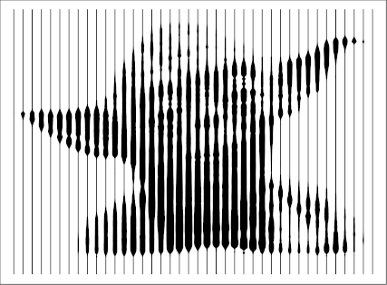
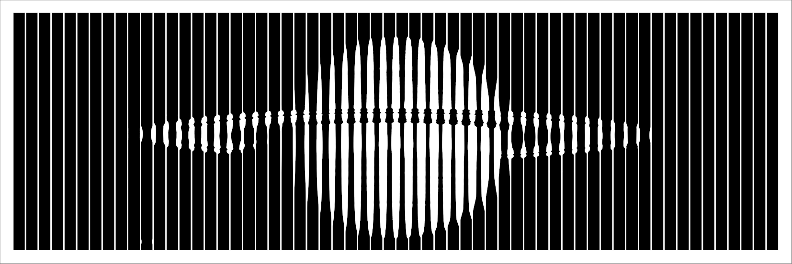
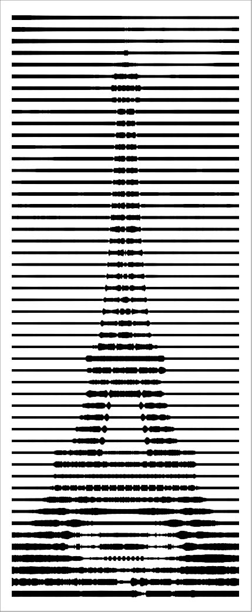
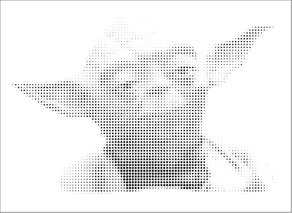

# vasarely
A standalone python to reproduce the style of Victor Vasarely in this artwork:


(Found in the entrance hall of the Centre Pompidou in Paris.)

The code produces SVG images.

## Usage

### Bands
```
python bands.py --file-in images/test1.png --n-bands 40
python bands.py --file-in images/test2.png --n-bands 60
python bands.py --file-in images/test3.png --n-bands 50 --axis 0
```
Input (any) | Output (SVG)
:---: | :---:
| 
| 
| 

```
usage: bands.py [-h] --file-in FILE_IN [--file-out FILE_OUT] [--invert]
                [--n-bands N_BANDS] [--axis AXIS] [--min-thick MIN_THICK]
                [--min-space MIN_SPACE] [--border BORDER]

optional arguments:
  -h, --help            show this help message and exit
  --file-in FILE_IN     Path of the input image.
  --file-out FILE_OUT   Path of the output SVG image. (default : input file
                        but it's SVG)
  --invert              Invert bright and dark values. (default : False)
  --n-bands N_BANDS     Number of shadow bands to use. (default : 32)
  --axis AXIS           1 for vertical bands, 0 for horizontal bands. (default
                        : 1)
  --min-thick MIN_THICK
                        Minimum thickness of a bright band, in ratio of a band
                        width. (default : 0.1)
  --min-space MIN_SPACE
                        Minimum space between adjacent bright bands, in ratio
                        of a band width. (default : 0.1)
  --border BORDER       Border size around the generated svg, in ratio of a
                        band width. (default : 1.)
```

### Tiles
```
python tiles.py --file-in images/test1.png --n-tiles-h 100
python tiles.py --file-in images/test2.png --n-tiles-v 50 
python tiles.py --file-in images/test3.png --n-tiles-h 100 --tile-type square
```
Input (any) | Output (SVG)
:---: | :---:
| 
| 
| 

```
usage: tiles.py [-h] --file-in FILE_IN [--file-out FILE_OUT] [--invert]
                [--n-tiles-h N_TILES_H] [--n-tiles-v N_TILES_V]
                [--tile-type TILE_TYPE] [--min-thick MIN_THICK]
                [--min-tile-size MIN_TILE_SIZE] [--border BORDER]

optional arguments:
  -h, --help            show this help message and exit
  --file-in FILE_IN     Path of the input image.
  --file-out FILE_OUT   Path of the output SVG image. (default : input file
                        but it's SVG)
  --invert              Invert bright and dark values. (default : False)
  --n-tiles-h N_TILES_H
                        Number of tiles to use horizontally. (At least one of
                        n-tiles-h and n-tiles-h must be provided)
  --n-tiles-v N_TILES_V
                        Number of tiles to use vertically. (At least one of
                        n-tiles-h and n-tiles-h must be provided)
  --tile-type TILE_TYPE
                        'squares' or 'circles'. (default : 'circles')
  --min-thick MIN_THICK
                        Minimum thickness of the bright grid, in ratio of a
                        tile size. (default : 0.1)
  --min-tile-size MIN_TILE_SIZE
                        Minimum size of the tiles, in ratio of a tile size.
                        (default : 0.)
  --border BORDER       Border size around the generated svg, in ratio of a
                        tile size. (default : 1.)
```
